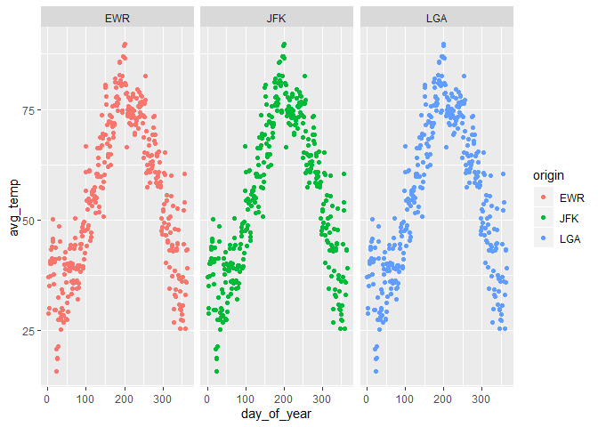

practice exam
================
XIYU Yang

#### Make a plot with three facets, one for each airport in the weather data. The x-axis should be the day of the year (1:365) and the y-axis should be the mean temperature recorded on that day, at that airport.

``` r
# Load the dataset
weather_df1 <- weather %>% 
  mutate(day_of_year = yday(time_hour)) %>% 
  group_by(day_of_year) %>% 
  mutate(avg_temp = mean(temp)) %>% 
  select(day_of_year, avg_temp, origin) %>% 
  distinct()

# Create facets from the data
p <-  ggplot(data = weather_df1,
             mapping = aes(x = day_of_year,
                           y = avg_temp,
                           color = origin))

p + geom_point() +
  facet_wrap(~ origin)
```

<!-- -->

#### Make a non-tidy matrix of that data where each row is an airport and each column is a day of the year.

``` r
weather_df2 <- weather_df1 %>% 
  pivot_wider(names_from = day_of_year, values_from =avg_temp)
head(weather_df2)
```

    ## # A tibble: 3 x 365
    ##   origin   `1`   `2`   `3`   `4`   `5`   `6`   `7`   `8`   `9`  `10`  `11`  `12`
    ##   <chr>  <dbl> <dbl> <dbl> <dbl> <dbl> <dbl> <dbl> <dbl> <dbl> <dbl> <dbl> <dbl>
    ## 1 EWR     37.0  28.7  30.0  34.9  37.2  40.1  40.6  40.1  43.2  43.8  41.2  45.0
    ## 2 JFK     37.0  28.7  30.0  34.9  37.2  40.1  40.6  40.1  43.2  43.8  41.2  45.0
    ## 3 LGA     37.0  28.7  30.0  34.9  37.2  40.1  40.6  40.1  43.2  43.8  41.2  45.0
    ## # ... with 352 more variables: `13` <dbl>, `14` <dbl>, `15` <dbl>, `16` <dbl>,
    ## #   `17` <dbl>, `18` <dbl>, `19` <dbl>, `20` <dbl>, `21` <dbl>, `22` <dbl>,
    ## #   `23` <dbl>, `24` <dbl>, `25` <dbl>, `26` <dbl>, `27` <dbl>, `28` <dbl>,
    ## #   `29` <dbl>, `30` <dbl>, `31` <dbl>, `32` <dbl>, `33` <dbl>, `34` <dbl>,
    ## #   `35` <dbl>, `36` <dbl>, `37` <dbl>, `38` <dbl>, `39` <dbl>, `40` <dbl>,
    ## #   `41` <dbl>, `42` <dbl>, `43` <dbl>, `44` <dbl>, `45` <dbl>, `46` <dbl>,
    ## #   `47` <dbl>, `48` <dbl>, `49` <dbl>, `50` <dbl>, `51` <dbl>, `52` <dbl>,
    ## #   `53` <dbl>, `54` <dbl>, `55` <dbl>, `56` <dbl>, `57` <dbl>, `58` <dbl>,
    ## #   `59` <dbl>, `60` <dbl>, `61` <dbl>, `62` <dbl>, `63` <dbl>, `64` <dbl>,
    ## #   `65` <dbl>, `66` <dbl>, `67` <dbl>, `68` <dbl>, `69` <dbl>, `70` <dbl>,
    ## #   `71` <dbl>, `72` <dbl>, `73` <dbl>, `74` <dbl>, `75` <dbl>, `76` <dbl>,
    ## #   `77` <dbl>, `78` <dbl>, `79` <dbl>, `80` <dbl>, `81` <dbl>, `82` <dbl>,
    ## #   `83` <dbl>, `84` <dbl>, `85` <dbl>, `86` <dbl>, `87` <dbl>, `88` <dbl>,
    ## #   `89` <dbl>, `90` <dbl>, `91` <dbl>, `92` <dbl>, `93` <dbl>, `94` <dbl>,
    ## #   `95` <dbl>, `96` <dbl>, `97` <dbl>, `98` <dbl>, `99` <dbl>, `100` <dbl>,
    ## #   `101` <dbl>, `102` <dbl>, `103` <dbl>, `104` <dbl>, `105` <dbl>,
    ## #   `106` <dbl>, `107` <dbl>, `108` <dbl>, `109` <dbl>, `110` <dbl>,
    ## #   `111` <dbl>, `112` <dbl>, ...

#### For each (airport, day) contruct a tidy data set of the airport’s “performance” as the proportion of flights that departed less than an hour late.

``` r
flights_df1 <- flights %>% 
  mutate(day_of_year = yday(time_hour)) %>% 
  group_by(origin, day_of_year) %>% 
  mutate(n1 = n()) %>% 
  filter(dep_delay < 60) %>% 
  mutate(n2 = n()) %>% 
  mutate(performance=n2/n1) %>% 
  group_by(origin, day_of_year) %>% 
  select(origin, day_of_year, performance) %>% 
  distinct()
head(flights_df1)
```

    # A tibble: 6 x 3
    # Groups:   origin, day_of_year [6]
      origin day_of_year performance
      <chr>        <dbl>       <dbl>
    1 EWR              1       0.915
    2 LGA              1       0.95 
    3 JFK              1       0.943
    4 JFK              2       0.947
    5 EWR              2       0.823
    6 LGA              2       0.967

#### Construct a tidy data set to that give weather summaries for each (airport, day). Use the total precipitation, minimum visibility, maximum wind\_gust, and average wind\_speed.

``` r
weather_df3 <- weather %>% 
  mutate(day_of_year = yday(time_hour)) %>% 
  group_by(origin, day_of_year) %>% 
  summarise(total_precipitation=sum(precip, na.rm=T),
            min_visibiligy=min(visib, na.rm=T),
            max_wind_gust=max(wind_gust, na.rm=T),
            avg_wind_speed=mean(wind_speed, na.rm=T))
head(weather_df3)
```

    ## # A tibble: 6 x 6
    ## # Groups:   origin [1]
    ##   origin day_of_year total_precipita~ min_visibiligy max_wind_gust
    ##   <chr>        <dbl>            <dbl>          <dbl>         <dbl>
    ## 1 EWR              1                0             10          26.5
    ## 2 EWR              2                0             10          26.5
    ## 3 EWR              3                0             10        -Inf  
    ## 4 EWR              4                0             10          31.1
    ## 5 EWR              5                0             10          26.5
    ## 6 EWR              6                0              6          19.6
    ## # ... with 1 more variable: avg_wind_speed <dbl>

#### Construct a linear model to predict the performance of each (airport,day) using the weather summaries and a “fixed effect” for each airport. Display the summaries.

``` r
# Combine the flight and the weather datasets
combined <- flights_df1 %>% 
  left_join(weather_df3, by=c('origin', 'day_of_year')) %>% 
  filter(!is.na(max_wind_gust),
         !is.na(total_precipitation),
         !is.na(min_visibiligy),
         !is.na(avg_wind_speed))

combined$max_wind_gust[which(combined$max_wind_gust == -Inf)] <- 0

# Construct the multiple linear regression model
lm1 <- lm(performance~origin+total_precipitation+min_visibiligy
         +max_wind_gust+avg_wind_speed, data=combined)
summary(lm1)
```

    ## 
    ## Call:
    ## lm(formula = performance ~ origin + total_precipitation + min_visibiligy + 
    ##     max_wind_gust + avg_wind_speed, data = combined)
    ## 
    ## Residuals:
    ##      Min       1Q   Median       3Q      Max 
    ## -0.48286 -0.02111  0.01958  0.04539  0.24003 
    ## 
    ## Coefficients:
    ##                       Estimate Std. Error t value Pr(>|t|)    
    ## (Intercept)          0.8253395  0.0106689  77.359  < 2e-16 ***
    ## originJFK            0.0319918  0.0070228   4.555 5.82e-06 ***
    ## originLGA            0.0198407  0.0067359   2.946  0.00329 ** 
    ## total_precipitation -0.0659334  0.0100531  -6.558 8.39e-11 ***
    ## min_visibiligy       0.0126167  0.0009021  13.986  < 2e-16 ***
    ## max_wind_gust       -0.0001739  0.0002959  -0.588  0.55670    
    ## avg_wind_speed      -0.0027120  0.0009646  -2.811  0.00502 ** 
    ## ---
    ## Signif. codes:  0 '***' 0.001 '**' 0.01 '*' 0.05 '.' 0.1 ' ' 1
    ## 
    ## Residual standard error: 0.09008 on 1085 degrees of freedom
    ## Multiple R-squared:  0.3042, Adjusted R-squared:  0.3003 
    ## F-statistic: 79.05 on 6 and 1085 DF,  p-value: < 2.2e-16

#### Repeat the above, but only for EWR. Obviously, exclude the fixed effect for each airport.

``` r
combined_EWR <- combined %>% filter(origin == 'EWR')
lm2 <- lm(performance~total_precipitation+min_visibiligy
         +max_wind_gust+avg_wind_speed, data=combined_EWR)
summary(lm2)
```

``` 

Call:
lm(formula = performance ~ total_precipitation + min_visibiligy + 
    max_wind_gust + avg_wind_speed, data = combined_EWR)

Residuals:
     Min       1Q   Median       3Q      Max 
-0.36778 -0.03505  0.02178  0.05282  0.25406 

Coefficients:
                      Estimate Std. Error t value Pr(>|t|)    
(Intercept)          0.8230185  0.0168807  48.755  < 2e-16 ***
total_precipitation -0.0656663  0.0168004  -3.909 0.000111 ***
min_visibiligy       0.0145382  0.0016778   8.665  < 2e-16 ***
max_wind_gust       -0.0007629  0.0005178  -1.473 0.141558    
avg_wind_speed      -0.0027934  0.0014755  -1.893 0.059135 .  
---
Signif. codes:  0 '***' 0.001 '**' 0.01 '*' 0.05 '.' 0.1 ' ' 1

Residual standard error: 0.09294 on 359 degrees of freedom
Multiple R-squared:  0.3249,    Adjusted R-squared:  0.3174 
F-statistic:  43.2 on 4 and 359 DF,  p-value: < 2.2e-16
```
